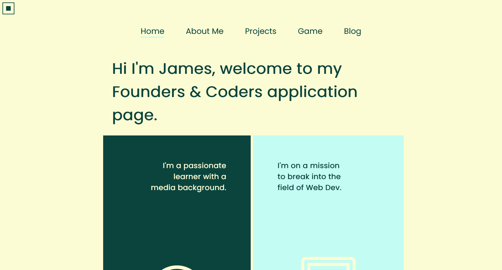
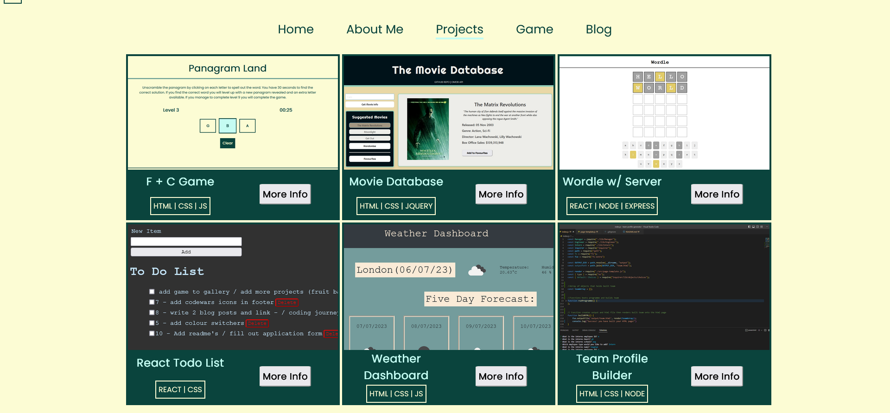
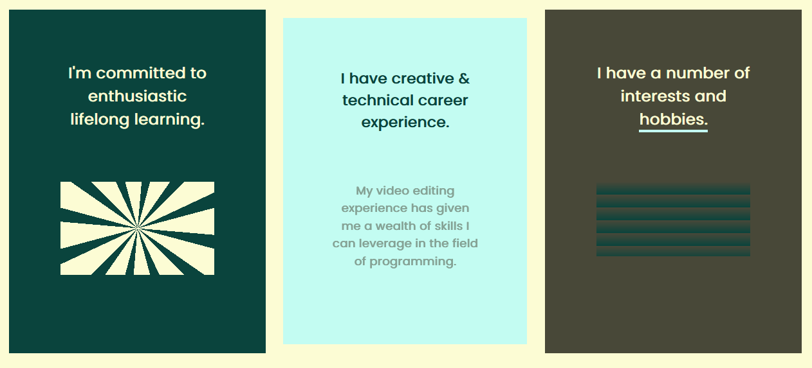
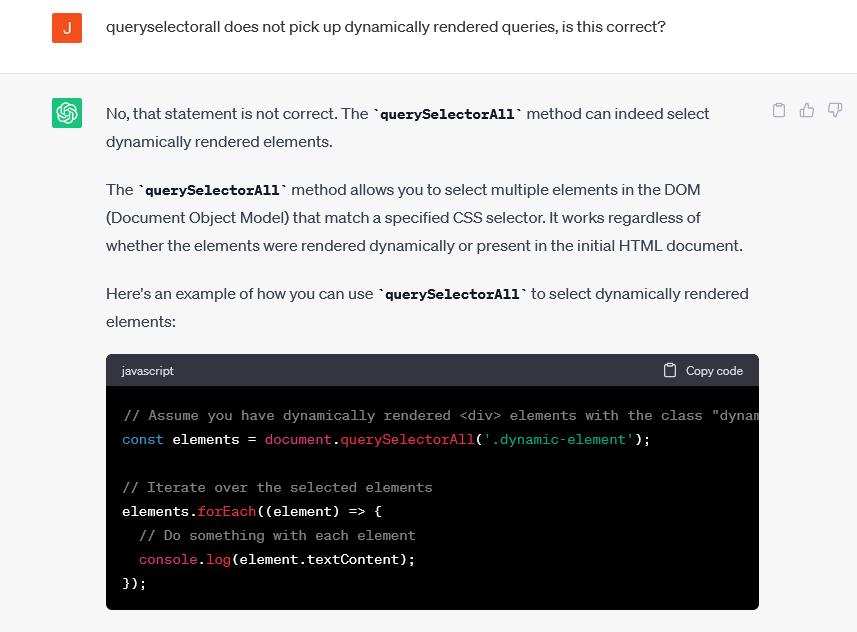
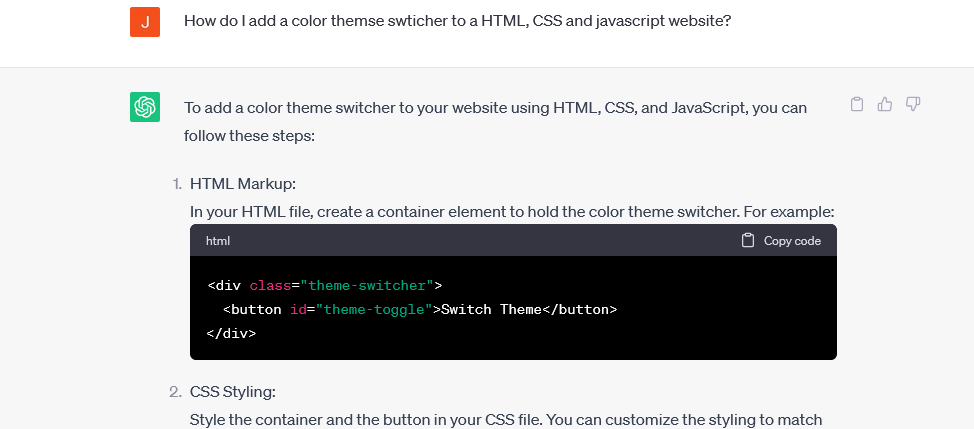

# Founders and Coders Application Website

    

This founders and coders application website is a muiltipage website built using HTML, CSS and Vanilla javascript. The website ties together the things I have picked up and worked on during my code learning journey. The website has a clear design and colour scheme, with links to blog posts I have written about my coding journey, as well as a project gallery with links to github repositories and deployed sites of projects that I have developed. There is a colour switcher in the top left of the screen that toggles between colour themes and some CSS animations and effects to make the user's interaction with the site interesting and enjoyable. The site also contains a footer with links to my LinkedIn, GitHub, Codewars and contact information. The website is mobile friendly, with a flexbox and media queries utilised to make the website responsive to screen size. 

My motivation in building this project is to showcase my web development skills to the founders and coders community and express my interest in the their software development programme. I also wanted to develop my web development skills further by gaining more experience in web development by learning and applying new skills. I also wanted to develop my ability to ustilise AI as a copilot when programming. 

## Table of Contents

- [Installation](#installation)
- [Usage](#usage)
- [Credits](#credits)
- [License](#license)
- [Features](#features)
- [AI](#ai)

## Installation

No installation neccessary, the site is deployed via GitHub pages at the following link:

https://jamesrobertsutcliffe.github.io/fc-application/

## Usage

The website is intuitive and straightforward to use on desktop and mobile. There are some features to look out for. 

- Click on the button at the top left of each page to switch between lighter and darker colour schemes.

- On desktop, hover over flex-boxes to reveal more text.

## Credits

- The Founders and Coders community for setting this task and supporting me throughout. 

https://www.foundersandcoders.com/

- Web Dev simplified YouTube channel for providing a tutorial on creatings modals in HTML, CSS and JS.

https://www.youtube.com/@WebDevSimplified

- Chat GPT for acting co-piloting the development of this website. See AI section at bottom of this doc for more in depth information on the utilisation.

https://openai.com/blog/chatgpt

## License

MIT License.

## Features

- Multi page.
- Defined colour scheme with colour toggle button.
- CSS animations and interactive effects. 
- Embedded links to my medium coding blog using external widget API.
- Responsive to screen size. 
- Modals.

## AI

I have utilised chat GPT as a co-pilot when building this website. Below are some examples of prompts I used in aid of this project.  

- To refresh my knowledge of DOM method query selector all and it's functionality. 

- To help me build the color theme toggle feature.

